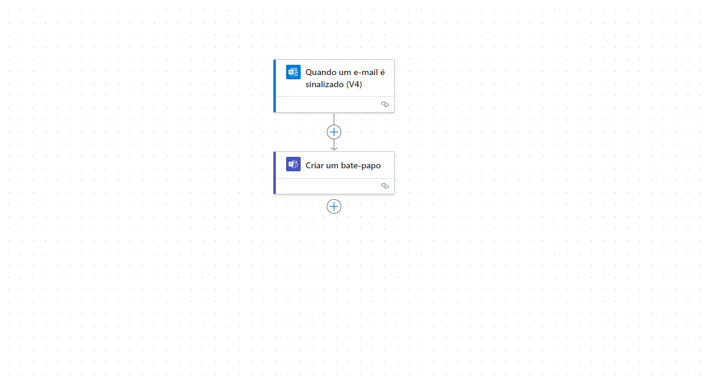

# Índice
* [Equipe](#equipe)
* [Objetivo do Projeto](#objetivo-do-projeto)
* [Sprints](#sprints)

# Projeto
Objetivo principal é mostrar o que foi aprendido ao longo do semestre nas aulas de informática aplicada 

# Objetivo do Projeto
Os objetivos definidos para esse projeto compõem-se em: 

* Desenvolver pesquisas qualitativas e consistentes para a movimentação de veículos no setor ferroviário, indicando as obras com alto valor rentável;

* Estruturação de plataformas necessárias para a organização do projeto, com foco no dinamismo, transparência e simplicidade na visualização de dados.

## Tecnologias Utilizadas

 ### Tecnologias da Informação
 > * Github
 > * Power BI
>  * Canva
>  * Excel
>  * Power Automate

# Apresentação

# Aplicativo Excel

# Aplicativo Power Bi

# Aplicativo Power APPS

 

# Aplicativo Power Automate

 

<!-- ## Obrigado por acessar nosso GitHub! :sparkles: -->

